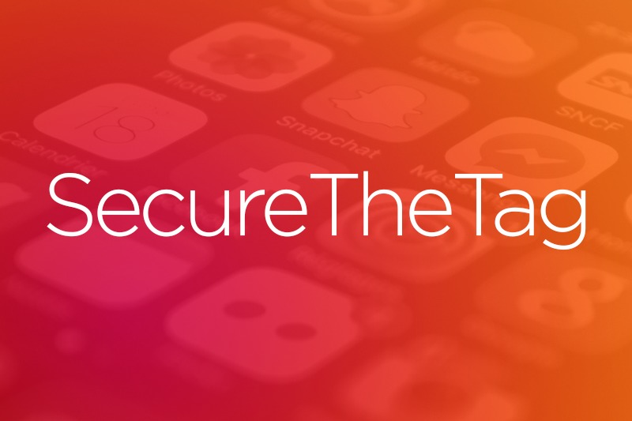
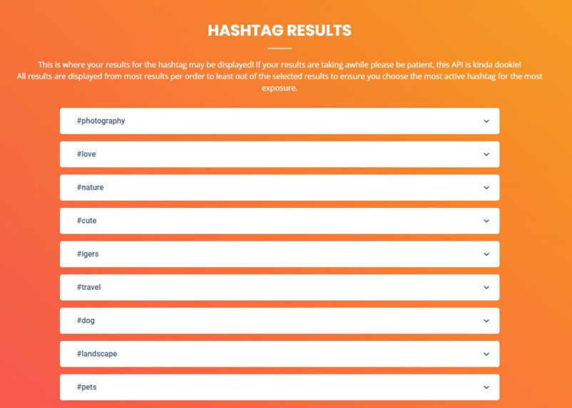

# SecureTheTag
*"Achieve the bag by securing them tags!"*

**Revolution UC 2021 Hack**

- A website that recommends relevant and trending hashtags based on an image that the user wants to post on Instagram.

## Authors
- Ahaan Limaye @ahaanlimaye
- Aryan Pal @aryanpal132
- Roland Yang @whyroland

## What it Uses

- Front end: HTML, CSS, JS, Bootstrap 5
- Back end: Node.js, Express.js, EJS
- Other: Google Cloud, Hashtagify

## Webpage
www.securethetag.online

## Devpost
https://devpost.com/software/securethetag

## Awards at GunnHacks 7.0
- 1st Place Overall
- Best use of Google Cloud (MLH)
- Best Design Hack

